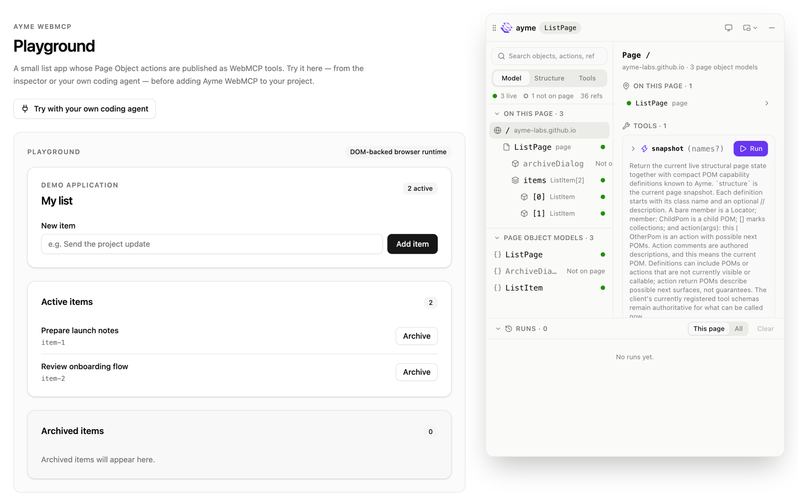
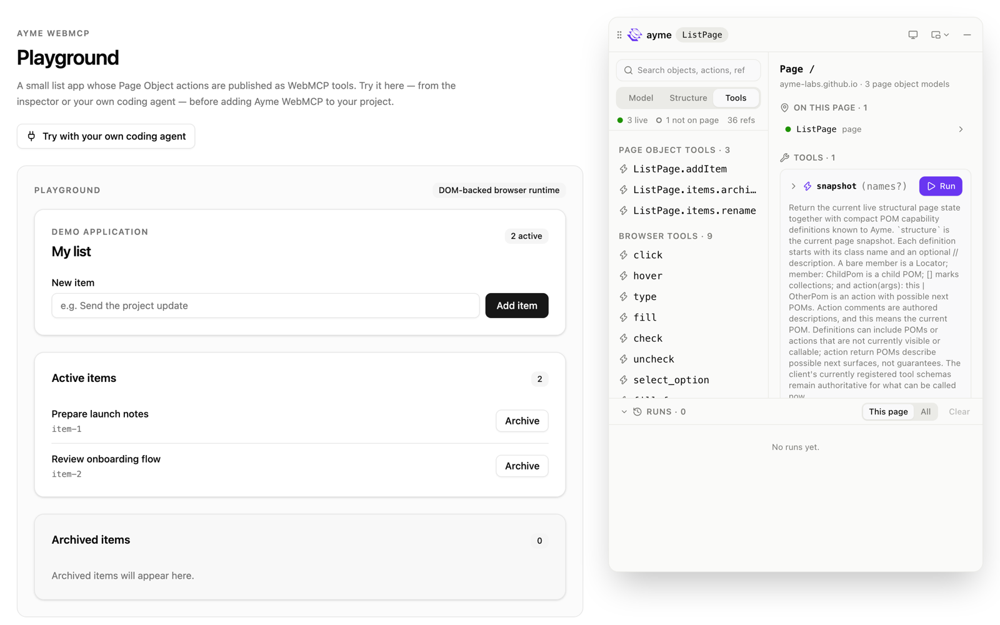

# Ayme

Ayme turns the Page Object Models from your Playwright tests into tools that coding agents and your own app can call in the running page.



<!--
Reserved for the Goal Loop clip, added once it is recorded.
-->

## Compared with Playwright

The same task on [Formbricks](https://github.com/formbricks/formbricks), a real survey app, done by Claude Code through four browser interfaces: rename a survey, change its question, save it and confirm the summary page. Three runs each; every cell is the median, with the lowest and highest in parentheses.

| Browser interface                     | Passes | Wall time             | Tool calls   | Tokens, input and output | Cost                                  |
| ------------------------------------- | ------ | --------------------- | ------------ | ------------------------ | ------------------------------------- |
| Playwright MCP                        | 3 of 3 | 46.9 s (45.1 – 54.7)  | 13 (11 – 14) | 1,546 (1,463 – 1,806)    | $0.155 ($0.126 – $0.166)              |
| Playwright CLI, with its skill        | 3 of 3 | 60.8 s (56.7 – 137.3) | 14 (13 – 20) | 1,557 (1,459 – 2,575)    | $0.140 ($0.140 – $0.225)              |
| Ayme's MCP server                     | 3 of 3 | 38.1 s (23.2 – 38.9)  | 6 (5 – 6)    | 755 (752 – 763)          | $0.129 ($0.126 – $0.171)              |
| Ayme's MCP server, with the Goal Loop | 3 of 3 | 56.7 s (25.5 – 63.3)  | 5 (5 – 9)    | 1,055 (904 – 1,679)      | $0.151 ($0.103 – $0.198), over 2 runs |

Measured on 2026-10-06 with Claude Code 2.1.281 on Sonnet (`claude-sonnet-5`) at medium effort, on Formbricks at the lab overlay [`8535b46`](https://github.com/ayme-labs/formbricks/tree/8535b463970d3f1d5c33ba6e4fe539a78b56c88c). Time, tokens, cost and calls are the task's alone: each run first gets the agent ready in a message of its own, which is not counted. Tokens are the agent's input and output tokens; reads and writes of its prompt cache are left out of that column but are in the cost, which is Claude Code's own figure. The Goal Loop row adds the Goal Loop's own model cost; one of its runs has no cost record yet. The full results, with every version a rerun must match, are in [the dated summary](apps/eval-formbricks/summaries/2026-10-06/summary.md), and [the eval](apps/eval-formbricks/README.md) reruns them.

## What you can do with it

- **Drive your app from your coding agent.** Claude Code, or any MCP client, calls your Page Object Actions on the page you have open, reads what is on the page and acts on it, while you develop.
- **Hand the page a goal.** An agent says "invite Ada as an admin", and the Goal Loop works the page toward it in small steps, each one judged by Jev, TypeSafe's decision model, instead of the agent's own LLM.
- **Build an in-app assistant.** An onboarding assistant inside your app gets your Page Object Actions and the page state as its tools, so it works the page while the user watches. A checklist's "Show me how" button can run the same actions directly. See [Build an in-app assistant](docs/guide/guides/in-app-assistant.md).

## How it works

You mark a Page Object Model and the actions to expose. The build plugin compiles them into your app, and when the app runs, Ayme offers three kinds of tools to agents: to a coding agent through Ayme's MCP server, and to agents in the browser through WebMCP, the browser's way of offering tools on a page:

- **Page Object Tools**: your marked actions, such as `ProjectsPage.createProject`.
- **Browser Tools**: built-in operations on the page, such as `click` and `fill`, aimed at what `snapshot` shows.
- **Custom Tools**: operations of your own on one element, such as highlighting it for the user.

The **Goal Loop** runs on top of them: `goal` takes a goal in natural language and lets Jev pick one operation per step until the goal is met or it needs the agent. Jev is reached through a **Decision Endpoint**, one route in your backend, or in your dev server while you develop, that adds your TypeSafe or OpenRouter key.

The **Inspector** is an in-page panel that shows your Page Objects, what the agent sees and every tool, and runs them by hand.



## Install

```sh
npm install @ayme-dev/ayme @ayme-dev/vue # or react, svelte
npm install -D @ayme-dev/unplugin-ayme @playwright/test
```

On Angular, `ng add @ayme-dev/angular` sets everything up. Then mark a Page Object Model:

```ts
import { ayme } from "@ayme-dev/ayme";
import type { Page } from "@playwright/test";

@ayme
export class ProjectsPage {
  constructor(private readonly page: Page) {}

  @ayme.action({ description: "Create a project with the given name." })
  async createProject(name: string) {
    await this.page.getByRole("button", { name: "New project" }).click();
    await this.page.getByRole("textbox", { name: "Project name" }).fill(name);
    await this.page.getByRole("button", { name: "Create" }).click();
  }
}
```

The quickstart for [Vue](docs/guide/start/quickstart-vue.md), [React](docs/guide/start/quickstart-react.md), [Svelte](docs/guide/start/quickstart-svelte.md) or [Angular](docs/guide/start/quickstart-angular.md) takes it from there to your agent calling `ProjectsPage.createProject`. A coding agent can do the setup for you with the [`ayme` skill](docs/guide/guides/coding-agent-skill.md).

## Documentation

Read the docs at [ayme-labs.github.io/ayme/docs](https://ayme-labs.github.io/ayme/docs/), or here on GitHub, starting from the [documentation index](docs/guide/README.md). The index lists every page in reading order: what Ayme is, install and the quickstarts first, then the guides, one page per framework, the reference and troubleshooting. GitHub renders the pages in place, and the links between them work.

## Your data stays with you

Ayme runs entirely in your app's page. It has no backend and no account, and it sends nothing to Ayme. Page content leaves the page in two ways, both set up by you: a coding agent you connect reads the page through Ayme's MCP server, which runs on your machine, and each Goal Loop step goes from your own Decision Endpoint, with your key, to the model provider you chose.

## License

Ayme is [Fair Source](https://fair.io), licensed under the
[Functional Source License, Version 1.1, ALv2 Future License](LICENSE)
(FSL-1.1-ALv2). You may use, modify, and redistribute it for any purpose other
than a Competing Use, including in your own applications and products. Each
version becomes available under the Apache License 2.0 two years after its
release.

Bundled third-party code keeps its original license; see each package's
`THIRD_PARTY_NOTICES.txt`.
