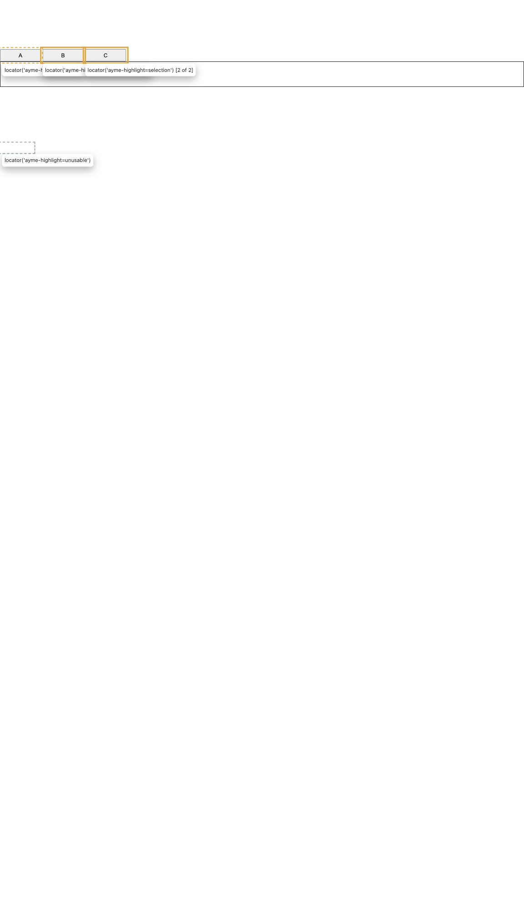

# Inspector highlights on Playwright's overlay

Research for #240 "Inspector: draw page highlights with Playwright's highlight overlay instead of host CSS". Input to a decision; this PR closes unmerged once the decision is recorded on the issue.

## What was inspected

- Fork: `ayme-labs/playwright-lite` tag `ayme-2026-09-30`, SHA `e95ea4b7cadd62ff4f6d74a5101506e7e855a899` (the current pin), package `0.7.0`.
- Types: lite types its `Page` and `Locator` as `@playwright/test` `1.62.1`'s.
- Ayme: `origin/main` at `a94a159`.
- Bundle line numbers below are in `dist/locator-lanr3TgC.mjs` of that install.

Where the code comes from:

- The overlay (`Highlight`, `x-pw-glass`) is Playwright's injected script. The fork builds it from `ayme-labs/playwright` (`docs/fork/SYNC.md`, first queue commit).
- The `Locator`/`Page`/`selectors` wrappers are playwright-lite code. Upstream is `enekesabel/playwright-lite`; fork-only changes go in the `ayme-labs/playwright-lite` patch queue.

## Finding 1: a supported boundary exists today

The triage comment checked `./internal` and found no overlay contract. The root entry has one. The fork README's compatibility ledger marks these ✅:

- `locator.highlight({ style })`, which returns a disposable
- `locator.hideHighlight()`
- `page.hideHighlight()`

`selectors.register` is ⚠️. Its notes matter here: the engine runs in the page's world, and registering an engine clears any active `highlight()`.

The Inspector holds `Element`s, but `highlight()` takes a selector. A registered engine closes that gap with no fork change:

- Register `ayme-highlight` once.
- Its `queryAll(root, layer)` returns the elements the Inspector put under a page-global key, the same pattern as the Inspector's shadow-root hook.
- `page.locator("ayme-highlight=hover").highlight({ style })` then draws that layer.

The engine source is stringified and evaluated (`engineSource`, l.18433), so it cannot close over module state; the page-global key is required.

## Finding 2: what the overlay does (probed)

The probe is `packages/inspector/src/overlayProbe.browser.test.ts`, which runs in the Inspector's `component` lane on Chromium. All 14 cases pass.

| Behaviour                                                   | Result                                                                                                                                                                                                                                                                                         | Evidence                                                  |
| ----------------------------------------------------------- | ---------------------------------------------------------------------------------------------------------------------------------------------------------------------------------------------------------------------------------------------------------------------------------------------- | --------------------------------------------------------- |
| Where it draws                                              | One `<x-pw-glass popover="manual">` appended to `<html>`, `:popover-open` (top layer), `pointer-events: none`, closed shadow root. No attributes on host elements.                                                                                                                             | probe; `Highlight` constructor l.11828                    |
| Multiple elements                                           | One box per element per layer. Each `highlight()` keeps its own `style`, appended after the defaults, so hover (dashed), selection (solid) and unusable (grey dashed) stay distinct.                                                                                                           | probe                                                     |
| Scroll, resize, viewport resize, layout shift, element swap | Boxes match `getBoundingClientRect()` after each change.                                                                                                                                                                                                                                       | probe; rAF re-query, `_ensureElementHighlightRaf` l.11907 |
| Removed element                                             | Dropped on the next frame.                                                                                                                                                                                                                                                                     | probe                                                     |
| Cleanup                                                     | Disposing a highlight or calling `locator.hideHighlight()` removes that layer. The pane stays until `page.hideHighlight()` removes it.                                                                                                                                                         | probe; `uninstall` l.11930                                |
| Pointer                                                     | `elementFromPoint` still hits the host element. Picking's capture listeners are unaffected.                                                                                                                                                                                                    | probe                                                     |
| Mutations and page state                                    | Nothing under `<body>` mutates, so the `ownAttributes` filter in the Inspector's observer becomes unnecessary (the observer itself stays, for refreshes). A host observer on `<html>`'s child list sees `X-PW-GLASS` added. `captureAriaSnapshot` of `<body>` or `<html>` does not include it. | probe                                                     |
| Cost                                                        | The engine is queried once per frame while any highlight is shown, and not at all after `page.hideHighlight()`.                                                                                                                                                                                | probe                                                     |
| **Tooltip**                                                 | Every box gets a visible tooltip with the selector, e.g. `locator('ayme-highlight=selection') [1 of 2]`. There is no option to turn it off.                                                                                                                                                    | probe + screenshot; `tooltipText` always set, l.11920     |
| **Clipping**                                                | An element scrolled out of its `overflow: auto` container is still boxed, over whatever lies below the container. The host outline was clipped there.                                                                                                                                          | probe; box is the unclipped `getBoundingClientRect()`     |
| **Top layer order**                                         | Over a popover opened before the highlight. Under one opened after: `_bringToFront` runs only on `install()` (l.11876), when the pane is created.                                                                                                                                              | probe (screenshot pixels)                                 |
| **Shared pane**                                             | One `Highlight` per window, shared by every lite `Page`. Another page's `hideHighlight()`, or any later `selectors.register`, removes the Inspector's highlights too.                                                                                                                          | probe; `injectedScriptFor` l.15385                        |

Not probed, inferred from the top-layer rule: the pane draws above the Inspector panel (`position: fixed; z-index: 9`), so a highlighted element behind the docked panel shows its box over the panel. Today's outline (`z-index: 1`) stays under it.

## Finding 3: what changes for styles, theme and cursor

- **Styles.** Three layers map to three `highlight()` calls with their own `style`. The selection's pulse cannot carry over: the pane's shadow root defines only `pw-fade-out`, and a style string cannot add `@keyframes`. A static `box-shadow` replaces it.
- **Theme.** The pane's `:host` sets `color-scheme: light`. Custom properties inherit from `<html>`, but the Inspector's tokens live in its own shadow root and don't reach it. The Inspector passes resolved colours in `style`; a theme change calls `highlight()` again, which replaces the style for that selector.
- **Cursor.** The pane takes no pointer events, so it cannot set a cursor. The picking style keeps `html, html * { cursor: crosshair !important }` and the host's `cursor: auto` exception as host CSS. Only the `[data-ayme-pick-unusable]` outline moves to the overlay.
- **Events.** The overlay changes nothing about event capture. Host capture listeners registered before the Inspector's still see picking presses; that is outside this change.

## Finding 4: testing

- Lite always creates the injected script with `isUnderTest: false` (l.15399), so the pane's shadow root is closed and the "Highlight box for test" log never fires. Tests cannot read rendered boxes through any lite API.
- The probe reads them through a test seam that wraps `Element.prototype.attachShadow` before the first highlight.
- Proposed split:
  - The Inspector's tests assert which elements each layer holds, read through a test hook. The Inspector stores its layers on its host element under a `Symbol.for` key, as `shadowRootHook.ts` does for its shadow root, and a helper in `@ayme-dev/inspector/testing` reads them. Under option A the engine can read the same hook. That helper replaces today's `toHaveAttribute("data-ayme-hover")` in `refPicking.spec.ts`, `runs.spec.ts` and `InspectorHighlights.browser.test.tsx`.
  - One component test keeps the probe's `attachShadow` seam and asserts that a layer renders as a box with its style.

## Options

**A. No fork change: `selectors.register` + `locator.highlight()`.** Everything above works today, but every box carries a selector tooltip and shares the pane with any other lite user.

**B. Smallest fork change: an element overlay in `./internal`.** The fork's lite wrapper already reaches the injected script, and the injected script has `createHighlight()` (l.14917). That returns a separate `Highlight` with its own glass pane, and its `updateHighlight(entries)` accepts entries without `tooltipText`.

A fork-only `./internal` export would expose the following. This option is read from source, not probed, since probing it needs the private objects the brief rules out.

- create an overlay for the document
- set each layer's elements and style
- dispose it

What that buys:

- No tooltip.
- Elements are passed directly: no engine and no page-global key.
- It can stay above dialogs and popovers opened later. `install()` (l.11876) always calls `_bringToFront()`, which hides and re-shows the popover, and re-appends the pane only when it is missing or no longer last. So the wrapper can call `install()` on each layer change without a DOM remove/insert. This is read from source and the popover spec, not probed.
- Not cleared by another page's `hideHighlight()` or by engine registration.

The Inspector runs a rAF while a layer is non-empty; `updateHighlight` skips unchanged boxes (l.12155). This changes only the `ayme-labs/playwright-lite` queue, not `ayme-labs/playwright`. It extends the `./internal` contract ADR-0021 describes, and it needs a new `ayme-<date>` tag and a repin.

Neither option fixes clipping, which comes from Playwright's `Highlight` itself.

## Proposal

Option B, in two steps:

1. **Fork.** In `ayme-labs/playwright-lite`, add the `./internal` element overlay with a contract test covering create, update, multiple elements, styles and dispose. Then tag and repin per ADR-0021.
2. **Inspector.** Replace `markElements` and the host highlight style with the overlay: one overlay per mounted Inspector, three layers. `refPicking.ts`'s `Mark` becomes the unusable layer. Drop `ownAttributes`, `highlightStyleText` and the attribute rule in `pickingStyleText`, and keep the cursor rules. Migrate the tests as in Finding 4.

If a fork change is not wanted, option A works today, with the tooltips.

## Open for approval

1. Extend the fork's `./internal` contract with an element overlay (B), or accept selector tooltips (A)?
2. Accept boxes drawn over clipped content and over the Inspector panel? A follow-up could skip elements fully outside their scroll container.
3. Accept that dialogs or popovers opened after a highlight cover it until the next layer change? Under B the wrapper re-fronts the pane on each change. Under A the only way is `page.hideHighlight()` and highlighting again, which removes and re-inserts the pane.
4. Drop the selection pulse.
